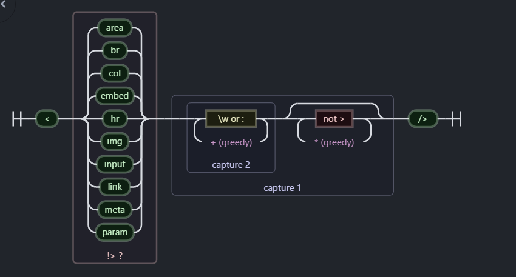

 对于Zepto源码分析，可以说是每个前端修炼自己js技能的必经之路。
当然，在读源码过程中，比较难以理解的地方，就是里面出现的各种神奇的正则表达式。
 本文主要分析对象是[zepto@1.1.6的源码](https://cdn.bootcss.com/zepto/1.1.6/zepto.js)中的**正则表达式**。


 **这篇文章，主要总结了zepto源码中使用到的一些正则表达式，分析每个正则使用场景**

关于正则表达式学习，推荐一本不错的书，[老姚](http://www.qdfuns.com/house/17398.html) 大神写的  [JavaScript 正则表达式迷你书](https://juejin.im/post/59cc61176fb9a00a437b290b)，戳里面的链接，可以下载pdf版，下面正则解释都可以从书中找到对应的位置，如果文中解释有误，也以书为准。引用书中强调的一句话。
> 正则表达式是匹配模式，要么匹配字符，要么匹配位置

 ###  1，fragmentRE = /^\s*<(\w+|!)[^>]*>/
  [看源码位置](https://github.com/madrobby/zepto/blob/master/src/zepto.js#L10)

  **匹配目标是否为html节点，比如" < html >，  < script> 样的单个未闭合节点**
   **可视化形式是：**
   

  `\s*` ,贪婪匹配空白符 ，`[^>]` 表示：匹配到的"<" 和">"中间内容不能出现">"，中间内容出现两个分支单词字符或者！，里面的`()`进行捕获分组，后面提取第一组的内容，下面代码中，则通过RegExp.$1 提取。

```
       fragmentRE.test("<sccc/>") && RegExp.$1;
       // "sccc"

```


### 2，singleTagRE = /^<(\w+)\s*\/?>(?:<\/\1>|)$/
 [看源码位置](https://github.com/madrobby/zepto/blob/master/src/zepto.js#L11)

**验证是否为单个闭合的html标签，形如 “< hr />  ,< script >< /script>”**
**可视化形式为：**  


`(\w+)` 分组引用，使用了捕获分组的概念，`Group #1`（或者图中的capture 1） ,为第一组数据，所以作用在于 后面使用 `1`提取前面对应的数据，后面还可以使用 $1,$2 捕获每组匹配的内容。

`(?:<\/\1>|) ` 对应的是非捕获括号，只想要括号最原始的功能，但不会引用它，里面的 `\1`，是第一个分组`（Group #1）`的内容，主要为了验证这个标签是成对的，前后内容一致。
```
singleTagRE.test("<hr/>")&&RegExp.$1
// "hr"
singleTagRE.test("<script></script>")&&RegExp.$1
// "script"
singleTagRE.test("<script></sscript>")&&RegExp.$1
// false

// zepto 中的源码。
zepto.fragment = function(html, name, properties) {
  var dom, nodes, container

  // A special case optimization for a single tag
  if (singleTagRE.test(html)) dom = $(document.createElement(RegExp.$1))
    // 这里捕获一个完整的闭合标签，并生成对应节点

```
### 3，tagExpanderRE = /<(?!area|br|col|embed|hr|img|input|link|meta|param)(([\w:]+)[^>]*)\/>/ig

 [看源码位置](https://github.com/madrobby/zepto/blob/master/src/zepto.js#L12)


**匹配自闭合的标签，形如：< div />**

 **zepto 里面 主要作用 < div />  ==> < div>< /div>**

 可视化形式：
 

 最后面的，`//ig`: 两个修饰符 `g`:表示全局匹配， `i`表示忽略大小写。
 

 然后再看 正则主体部分内容，"< " 和 "\/ >"中间的内容大致可以分为两部分：
  - `(?!area|br|col|embed|hr|img|input|link|meta|param)`

      上面大致可以简化成 `(?!p)`，也就是要匹配位置。
      要解释这个，首先要对应的提出`(?=p)`，p 是一个子模式，指代p前面的位置，也说明**该位置后面的字符要匹配p**.列举书中实例
      ```
        var result = "hello".replace(/(?=l)/g,'#');
        console.log(result);
        // => "he#l#lo"
      ```
      相应的开头提到的 `(?!p)`就是反面意思
      ```
         var result = "hello".replace(/(?!l)/g,'#');
         console.log(result);
         // => "#h#ell#o#"

      ```
      > (?=p) 和 （?!p) 学名分别是 positive lookahead  和 negative lookahead.
      > 中文翻译分别是正向先行断言和负向先行断言

      这里我们可以理解为 **`#`后面的字符串不能匹配`l`**，这里说的`#`,在原字符串"hello"中时不存在的，只是代表字符之间的各个位置，输出`#h#ell#o#`只是实例化匹配展示出来了对应的位置。

      **`<`右边不能是 `area,br,col,embed,hr,img,input,link,meta,param`,比如像 < img /> < br/> 这样就不需要转化了**

      ```
        var tagExpanderRE = /<(?!area|br|col|embed|hr|img|input|link|meta|param)(([\w:]+)[^>]*)\/>/ig;
        "".replace(tagExpanderRE, "<$1></$2>")
        // 输出 " "

      ```

  - `(([\w:]+)[^>]*)`

      这里使用了捕获分组，分了两组`(([\w:]+)[^>]*)` 和 `([\w:]+)`，作用在于，replace的时候可以通过$1 和 $2 提取匹配到的数据。

      `([\w:]+)` 中 `+` 就是 {1，}的简写 ，表示`\w`(数字，字母，下划线)或者` :` 至少出现一次 通常是标签名，div,span 等等
      `(([\w:]+)[^>]*)`   多了 `[^>]*` 表示匹配`>`以外的任意内容，比如 < div class="div-class"> 中的` class="div-class"`。可以这么理解，比 `.*`能够匹配所有内容多加了一个条件

  ```
  var tagExpanderRE = /<(?!area|br|col|embed|hr|img|input|link|meta|param)(([\w:]+)[^>]*)\/>/ig;
  '<div class="div-class" />'.replace(tagExpanderRE, "<$1></$2>")
  // 输出 "<div class="div-class" ></div>"

  ```

### 4，rootNodeRE = /^(?:body|html)$/i
   [看源码位置](https://github.com/madrobby/zepto/blob/master/src/zepto.js#L13)

   **通过检测节点的nodeName属性，判断是否为body或者html 根节点**

   可视化形式：
   

```
  var ootNodeRE = /^(?:body|html)$/i;
  var htmlDom = document.querySelector("html")
  rootNodeRE.test(htmlDom.nodeName);
  // 输出 true;
  var divDom = document.querySelector("div");
  rootNodeRE.test(htmlDom.nodeName);
  // 输出 false

```
