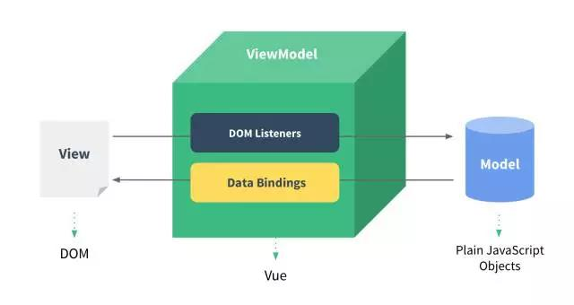

## Vue2.x 总结 ##

 > Vue 是一套用于构建用户界面的渐进式框架

 也意味着，既可以把VUE作为该应用的一部分嵌入到一个现成的服务端应用，或者在前后端分离的应用中，利用Vue 的核心库及其生态系统，把更多的逻辑放在前端来实现。


## A Progressive Framework ##
   **渐进式框架**

   与Vue相比，React学习曲线陡峭，在学习React之前，需要了解JSX和ES2015,当然入门后，发现还要学习React全家桶。而Vue就可以在简单阅读了文档后，开始构建应用程序。

   这就要得益于Vue主张的 **渐进式**。
   可以简单看下官方给出这张图：
   

  可以看出来，主要是介绍了Vue设计思想，就是框架做分层设计，每层都可选，可以单独引入，为不同的业务需求制定灵活的方案。主张最少，不会多做职责以外的事。

   [Vue作者尤雨溪的观点][1],Vue设计上包括的解决方案很多，但是使用者完全不需要一上手，就把所有东西全都用上，因为完全没有必要，一般都是根据项目的复杂度，在核心的基础上任意选用其他的部件，不一定要全部整合在一起。

   也就是，这样渐进式的解决方案，然后学习成本大大减少了。


## 声明式渲染 ##
 也就是说，DOM状态只是数据状态的一个映射，基本所有的框架都已经认同了这个看法，Vue也是主张 **数据驱动状态**。

 说到这里，基本都会提到现在主流的`MVVM`的模式。
 

 采用了双向数据绑定的思想，基本可以分为三层：
  - M(Model,模型层)，负责业务数据相关。
  - V(View,视图层)，视图相关，展示给用户的交互界面，同时捕获用户的操作
  - VM(ViewModel, V与M连接的桥梁，也可以看做控制器)。

基于这个思想，Vue从一开始就利用ViewModel与view，model进行交互
 
ViewModel是Vue.js的核心，它是一个Vue实例，作用在某个HTML元素上，一般都是指定 `id= app`的元素，图中 的`DOM listeners` 和`Data Bindings`可以看做两个工具，它们是实现双向数据绑定的关键。

   从用户(View)角度看，`DOM Liisteners`利用在相应的元素上添加事件绑定，捕获用户的点击，滑动等手势动作，在事件流中改变对应的`Model`。比如 常用的 `v-model` 指令，就是捕获表单元素的`input`，`change`等事件，改变相应的绑定值。

   从Model方向看，`Data Bindings`则将操作的数据变化，反应到view上。比如通过ajax 从后台获取的数据，可以刷新数据列表，反应到用户界面。这也是实现双向数据绑定的关键。

   Vue2中是通过`Object.definedProperty`方法中定义的getters和 setters构造器来实现数据响应的。可以简化下源码中的实现：
   ```
Object.defineProperty(obj, key, {
  enumerable: true,
  configurable: true,
  get: function reactiveGetter () {
    return value
  },
  set: function reactiveSetter (newVal) {
    var value = getter ? getter.call(obj) : val;
    /* eslint-disable no-self-compare */
    if (newVal === value || (newVal !== newVal && value !== value)) {
      return
    }
    /* eslint-enable no-self-compare */
    if ("development" !== 'production' && customSetter) {
      customSetter();
    }
    if (setter) {
      setter.call(obj, newVal);
    } else {
      val = newVal;
    }
    childOb = !shallow && observe(newVal);
    dep.notify();
  }
});
}
   ```
通过这种方法定义对象`obj`上的某个属性，每次获取属性值的时候就，会主动触发`get`对应的回调函数，然后给该属性赋值时，就会触发里面的`set`对应的回调函数，在`set`回调函数里面，加入了`dep.notify()`方法，然后可以[看下这个方法](https://github.com/vuejs/vue/blob/dev/src/core/observer/dep.js#L36)

```
notify () {
 // stabilize the subscriber list first
 const subs = this.subs.slice()
 for (let i = 0, l = subs.length; i < l; i++) {
   subs[i].update()
 }
}
```
里面的定义的常量`subs`每次深拷贝`this.subs`数组，数组里面保存的就是所有的`subscriber`订阅者,对应的发布者就是`obj`里面对应的属性，或者说是Vue中的`data`值。通知所有的订阅者，数据更新了。原生js实现发布订阅模式（publish/Subscribe)，[可以参考这里](http://www.cnblogs.com/TomXu/archive/2012/03/02/2355128.html)

## 常用基础语法 ##
### hello world  ###
 ```
   <!DOCTYPE html>
   <html>
     <head>
       <meta charset="utf-8">
       <title>hello world</title>
       <script src="https://gw.alipayobjects.com/as/g/h5-lib/vue/2.4.4/vue.min.js"></script>
     </head>
     <body>
       <div id="app">
         {{message}}
       </div>
       <script>
         var app = new Vue({
           el:"#app",
           data:{
             message:'hello vue'
           }
         })
       </script>
     </body>
   </html>
 ```
 这样就简单创建了一个Vue 应用，数据`message` 和DOM页面产生了关联，类似html模板引擎，把相应的数据渲染到页面中。

### 指令 ###
   指令 (Directives) 是带有 v- 前缀的特殊属性，这些特殊属性可以响应式的作用域DOM,
  - **v-if**  接受Boolean 类型,比如： `<p v-if = "seen">现在你看到我了</p> `，通过`seen`的真假来插入/移除< p>元素。 **这里判断的时候使用 === 全等，seen = “false” 的时候，也会插入**
  - **v-bind**,响应式的更新HTM属性。完整形式`<a v-bind:href="url">...</a>` 。  缩写形式`<a :href="url">...</a>`。 常用于改变dom的style, class ,href ,src 等属性。  动态绑定的属性可以写成   **:属性名="属性值" **

  - **v-on**，绑定点击事件,比如 完整形式`<a v-on:click="doSomething">...</a>`，简写形式 `<a @click="doSomething">...</a>`, `doSomething`对应的指向`methods`里面定义的函数。 注意，除非在需要传递参数的时候，写成 @click = "doSomething($event,args1,args2)",`$event`代表事件对象，`args`代表自定义参数


### style or class ###
  将`v-bind`用于`class`和`style`时，Vue.js做了专门的增强，表达式结果的类型除了字符串之外，还可以是对象或数组。

  **绑定HTML Class**
   - 直接赋值。
      ```
      < div :class="className"> </div>
      data:{
         className:"div-class"
      }
      ```
     结果:
     ```
        <div class="div-class"></div>
     ```

   - 对象语法。
   ```
      < div class="static" :class="{active:isActive,'text-danger':hasError}" /></div>

      data: {
        isActive:true,
        hasError:false,
      }
   ```
    结果：
    ```
      <div class="static active" ></div>

    ```

- 数组语法，
    ```
      <div :class="['one',bTwo?'two':'three']" </div>

      data:{
         bTwo:true
      }

      <style>
         .one{}
         .two{}
    ```
     结果：
     ```
        <div class='one two'></div>
     ```

**绑定内联样式**
 - 对象语法
       ```
         <div :style = "{color:activeColor,fontSize:fontSize+'px'}"></div>
         data: {
           activeColor: 'red',
           fontSize: 30
         }
       ```
       结果：
        ```
          <div style="color:red:font-size:30px;"></div>
        ```
 - 数组语法
     ```
       <div v-bind:style="[baseStyles, overridingStyles]"></div>

       data:{
         baseStyles:{
           color:'red'
         },
         overridingStyles:{
           fontSize:'30px'
         }

       }

     ```

     结果：
     ```
       <div style="color:red:font-size:30px;"></div>
     ```

**条件渲染**
   - v-if

     同样也是一个指令，添加到一个元素上，对应利用 `===` 全等判断绑定的值`true`或`false`来决定是否渲染里面的节点。
     可以与它一起使用的指令有 `v-else` ,`v-else-if`,`v-else` 元素必须紧跟在都有`v-if`或者`v-else-if`的元素后面
     ```
       <div v-if= "num===0">
        0
        </div>
        <div v-else-if ="num ===1">
        1
        </div>
        <div v-else>
           not 0/1
        </div>

        data:{
          num:3
        }
     ```
     结果：
     ```
     <div>
         not 0/1
     </div>
     ```

- v-show

   根据条件展示元素的选项,简单的切换元素的内联样式`display`

    适用场景：
    - 页面复用的（modal）弹出窗，利用`v-show`，控制显示或者隐藏。[参考这里](https://www.zhihu.com/question/35820643)
    - tab页面切换的时候，不同页面不相互影响，利用`v-show`不会销毁元素，[参考这里](https://segmentfault.com/q/1010000011557565)

**列表渲染**
 - v-for 把一个数组对应为一组元素,推荐给每个列表，添加唯一标识的`key`值
   ```
     <div v-for="(item,idx) in items" :key="idx">
        {{idx}} --- {{item.product}}
     </div>

     data:{
       items:[
        {product:"foo"},
        {product:"bar"}
       ]
     }
   ```
   结果:
   ```
   <div>
         0 --- foo
   </div>
   <div>
       1 --- bar
   </div>
   ```

- 数组更新检测

    包含一组观察数组变异方法，用来触发试图更新：
    `push()`,`pop()`,`shift()`,`unshift()`,`splice()`,`sort()`,`reverse()`

    **利用索引给数组赋值或者手动修改数组的长度，都不会被检测到更新**
   替代方案：
     ```
      Vue.set(example1.items,indexOfItem,newValue)
      // 或者
      example1.items.splice(indexOfItem,1,newValue)

      // 改变数组的长度：
      example1.items.splice(newLength)
    ```
    对于对象中的属性添加或删除，也可以使用`Vue.set`方法,或者在定义的Vue实例内部，使用`this.$set`,`this.$set`只是全局`Vue.set`的别名
    ```
     Vue.set(object,key,value)
    ```

### v-model 表单绑定 ###
   使用`v-model`在表单`input`或 `<textarea>`元素上创建双向数据绑定。
   ```
    <input v-model = "message" placeholer= "edit me">
    <p>Message is {{message}}</p>
   ```

   这样input输入框中的值就与P标签中的内容绑定了，同样也适用`textarea`，`checkbox`,
   `radio`,`select`等表单。

   实质上，`v-model`只是语法糖。
   ```
     <input v-model = "something"
   ```
   对应的完整形式：
  ```
      <input
         v-bind:value="something"
         v-on:input="something = $event.target.value">
  ```

  表单数组校验。
   利用修饰符 `.number`进行数字校验，是最实用的方法，在`v-model`上添加`number`修饰符。
  ```
    <input v-model.number="age" type= "number" >
  ```

## 组件通信 ##

[组件可以用来扩展HTML](https://cn.vuejs.org/v2/guide/components.html)，封装可重用的代码，所有的组件都是Vue的实例。

**命名**： 建议遵循W3C规则(小写，并且包含一个短杆)

**组件组合**：使用中最常见的是形成父子组件的关系，组件A在它的模板中使用了组件B,那么他们之间就需要通信。组件间通信的关系可以用下面的图示表明：
 

  概括为： prop 向下传递，事件向上传递。

   - 利用Prop 传递数据,同时借助`.sync`,进行双向数据通信

      父组件的数据要通过Prop才能下发到子组件中。
      prop 属性命名：在使用camelCase(驼峰式命名)的prop需要装换成对应的kebab-case(短横线分隔式命名)。同时，也可以绑定动态的Prop传递给子组件

      然后，子组件中prop值改变，是无法反应到父组件中的。在Vue1.x中使用`.sync`修饰符可以提供双向绑定，但是违背了单向数据流的思想，在2.0中就移除了，但在2.3.0中作为一种语法糖的形式引入了

      ```
        Vue.component('child',{
          props:['myMessage'],
          template:'<span @click="handleClick">{{myMessage}}</span>',
         methods:{
            handleClick:function(){
              this.$emit("update:myMessage","message from child")
            }
         }
        })

        <!--  在HTML 中使用时   .sync的语法糖  -->
        <child :my-message.sync="parentMsg"></child>

      ```
     点击子组件中的span，就可以改变父组件中prop绑定的`parentMsg`值。`.sync`语法也会被扩展成为
      ```
        <child :my-message="parentMsg" @update:myMessage = "val => parentMsg = val"
      ```
      里面 `@update:myMessage` 就是绑定了自定义事件，回过来看下上面父子通讯的规则 **prop向下传递，事件向上传递**，也非常符合。

- 非父子组件通信

     官方推荐使用空的Vue实例作[事件总线](https://cn.vuejs.org/v2/guide/components.html#非父子组件的通信)
      ```
        var bus = new Vue();

      // 在A 组件中触发了事件
       bus.$emit("change",1);

      // 在B 组件中监听事件
      bus.$on('change',function(id){})
      ```


## 状态管理 ##
  组件通信变得复杂时，就要考虑使用全局状态管理，Vue也提供了[vuex](https://vuex.vuejs.org/zh-cn/intro.html)状态管理库。

  > Vuex 是一个专门为Vue.js应用程序开发的状态管理模式。它采用集中式存储管理应用的所有组件的状态，并以相应的规则保证状态以一种可预测的方式发生变化。

  当然，使用Vuex并不是首选，只有在构建中大型单页面应用时，考虑到全局的状态管理，自然就会想到Vuex。
  下面这张图，表示状态管理“单向数据流”的理念
  

  核心概念包括（简单计数器为例）：
  - state: 作为单一状态树，唯一的数据源，并且每个应用仅仅包含一个`store`实例，一般通过计算属性获取某个状态。
  ```
  state:{
    count:0
  },
  ```
  - getter: 相当于store的计算属性，数据源发生变化时，返回经过处理后的值，

   ```

   getters:{
      getState:state=>{
        return state.count
      }
   },

   ```

  - mutation: 类似于事件，对应的回调函数到状态进行处理，必须通过`store.commit`的方式手动触发

  ```
  mutations:{
    increment:state => state.count++,
    decrement:state => state.count--
  },

  ```
  - actions: 利用`commit`提交mutation,可以执行异步操作，通过 `store.dispatch`方式触发

  ```
  // 模拟异步请求
  var delay = (timeout,cb) => new Promise(resolve => setTimeout(()=>{cb(); resolve("test incrementAsync")},timeout));

  actions:{
    incrementAsync({commit}) {
        return delay(600,function(){commit("increment")})

    },
  }

  ```
  - module: 当store对象比较庞大的时候，可以考虑将store分隔成模板。每个模块拥有自己的state、mutation、action、getter。很少情况下使用

  把所有部分组合起来，就构成一个简单的计数器：
  ```
  var delay = (timeout,cb) => new Promise(resolve => setTimeout(()=>{cb(); resolve("test incrementAsync")},timeout));
  var store = new Vuex.Store({
    state:{
      count:0
    },
    getters:{
       getState:state=>{
         return state.count
       }
    },
    mutations:{
      increment:state => state.count++,
      decrement:state => state.count--
    },
    actions:{
      incrementAsync({commit}) {
          return delay(600,function(){commit("increment")})
      },
      decrementAsync({commit}) {
          return delay(600,function(){commit('decrement')});
      }
    }
  })
  ```

然后组件中触发`actions`,就可以
```
store.dispatch('decrementAsync').then(() => {
// ...
})
```
在浏览器中，使用vue-devtool,试下时间旅行功能。
。

  vue-router 默认hash模式，每次url只会改变`#`后面对应的值，页面就不会重新加载，并且也不需要服务器端作任何配置。

  如果使用路由的history模式，url就会正常`http://yoursite.com/user/id`，只需要添加配置`mode:'history'`,同时需要后端配置，不然页面重新刷新，会匹配不到任何资源。

  不同模式下的服务器配置及生产环境部署，可以参考[vue、react等单页面项目应该这样部署到服务器](https://segmentfault.com/a/1190000012675012).

  **基础概念：**
  - < router-link>
    ```
      <router-link to="/foo">GO to Foo </router-link>
      <router-link to= "/bar">Go to Bar</router-link>
    ```

    使用router-link 组件导航，通过传入`to`属性指定链接，相当于原生的`a` 标签。

  - < router-view>
     路由出口，路由匹配到的组件将渲染在这里
     ```
      <router-view></router-view>
     ```
     可以在上面添加一些过渡效果
     ```
       <transiton name="slide">
          <router-view></router-view>
       </transiton>
     ```
  - 初始化路由配置

     如果使用`vue-cli`脚手架构造项目，在init的时候，会出现选项提示用户安装路由

     

     确认后，自动生成`src/router.js`文件，相关路由配置文件就可以写在里面。
     ```
       // 首先引入不同的vue组件(默认安装了[vue-loader](https://vue-loader.vuejs.org/zh-cn/start/spec.html),每个.vue文件看成一个完整的组件)
       import components1 from "./page/xx.vue"
       import components2 from "./page/xx2.vue"

       // router 数组用来定义路由配置，不存在子路由


     ```


参考链接
   - [Vue2.0 ，渐进式解决方案，Vue作者尤雨溪的观点][1]
   - [渐进式解决方案，知乎回答][2]
   - [MVC,MVP,MVVM 图示][3]
   - [vue.js 60分钟入门][4]
   - [如果实现双向数据绑定][5]
   - [Vue.js 源码： hello world 的背后](6)
   - [设计模式之观察者模式](7)
   - [vue、react等单页面项目应该这样子部署到服务器][8]


   [1]:https://mp.weixin.qq.com/s?__biz=MzIwNjQwMzUwMQ==&mid=2247484393&idx=1&sn=142b8e37dfc94de07be211607e468030&chksm=9723612ba054e83db6622a891287af119bb63708f1b7a09aed9149d846c9428ad5abbb822294&mpshare=1&scene=1&srcid=1026oUz3521V74ua0uwTcIWa&from=groupmessage&isappinstalled=0#wechat_redirect&utm_source=tuicool&utm_medium=referral

   [2]:https://www.zhihu.com/question/51907207

   [3]:http://www.ruanyifeng.com/blog/2015/02/mvcmvp_mvvm.html

   [4]:http://mp.weixin.qq.com/s/LePPVgNLKGnli7YaWVysHg
   [5]:https://github.com/DMQ/mvvm
   [6]:https://segmentfault.com/a/1190000006866881
   [7]:http://www.cnblogs.com/TomXu/archive/2012/03/02/2355128.html
   [8]:https://segmentfault.com/a/1190000012675012
